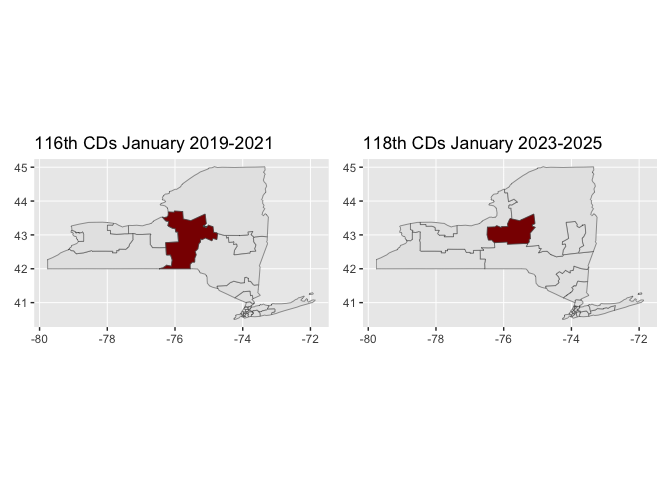

<!-- README.md is generated from README.Rmd. Please edit that file -->

# ggdistricts \< 1.0 MB

<!-- badges: start -->

<!-- badges: end -->

The goal of ggdistricts is to …

## Installation

You can install the development version of ggdistricts from
[GitHub](https://github.com/) with:

``` r
# install.packages("devtools")
devtools::install_github("EvaMaeRey/ggdistricts")
```

``` r
library(ggdistricts)
library(ggplot2)
library(dplyr)
#> 
#> Attaching package: 'dplyr'
#> The following objects are masked from 'package:stats':
#> 
#>     filter, lag
#> The following objects are masked from 'package:base':
#> 
#>     intersect, setdiff, setequal, union

head(districts_116_flat)
#>   DISTRICT      AFFGEOID GEOID LSAD CDSESSN      ALAND    AWATER STATE_FIPS
#> 1       10 5001600US3410  3410   C2     116  196397289  12474852         34
#> 2       05 5001600US4205  4205   C2     116  548506604  26310378         42
#> 3       12 5001600US0612  0612   C2     116  100885569 211661576          6
#> 4       03 5001600US1203  1203   C2     116 9232593580 722972427         12
#> 5       45 5001600US0645  0645   C2     116  856078764   5161857          6
#> 6       07 5001600US1207  1207   C2     116 1017471375 110917454         12
#>     STATE_NAME STATE_ABB
#> 1   New Jersey        NJ
#> 2 Pennsylvania        PA
#> 3   California        CA
#> 4      Florida        FL
#> 5   California        CA
#> 6      Florida        FL

districts_116_flat |>
mutate(id = 1:n()) |>
ggplot() +
  aes(state = STATE_NAME, 
      district = DISTRICT) +
  geom_district_116(drop_state = c("Alaska", "Hawaii")) +
  aes(fill = STATE_ABB) + 
  labs(title = "116th")->
plot_116th

districts_118_flat |>
mutate(id = 1:n()) |>
ggplot() +
  aes(state = STATE_NAME, 
      district = DISTRICT) +
  geom_district_118(drop_state = c("Alaska", "Hawaii")) +
  aes(fill = STATE_ABB) + 
  labs(title = "118th") ->
plot_118th

library(patchwork)
(plot_116th / plot_118th )+ plot_layout(guides = "collect")
#> Joining with `by = join_by(state, district)`
#> Joining with `by = join_by(state, district)`
```


``` r
library(ggdistricts)
library(ggplot2)
library(dplyr)
districts_116_flat |>
ggplot() +
  aes(state = STATE_NAME, 
      district = DISTRICT) +
  geom_district_116(keep_state = "New York") + 
  labs(title = "116th") ->
plot_116th_ny

districts_118_flat |>
ggplot() +
  aes(state = STATE_NAME, 
      district = DISTRICT) +
  geom_district_118(keep_state = "New York") + 
  labs(title = "118th")->
plot_118th_ny

library(patchwork)
plot_116th_ny + plot_118th_ny
#> Joining with `by = join_by(state, district)`
#> Joining with `by = join_by(state, district)`
```


``` r


(plot_116th_ny + 
  geom_district_116(keep_state = "New York", 
                    keep_district = 22, fill = "darkred")) +
(plot_118th_ny + 
  geom_district_118(keep_state = "New York", 
                    keep_district = 22, fill = "darkred")) 
#> Joining with `by = join_by(state, district)`
#> Joining with `by = join_by(state, district)`
#> Joining with `by = join_by(state, district)`
#> Joining with `by = join_by(state, district)`
```



# lots of points…

This was a note about previous files in use

``` r
library(sf)
#> Linking to GEOS 3.10.2, GDAL 3.4.2, PROJ 8.2.1; sf_use_s2() is TRUE
sum(rapply(st_geometry(districts_116), nrow)) # big
#> [1] 30166
sum(rapply(st_geometry(ggnc::nc), nrow)) # needlessly
#> [1] 2529
```
