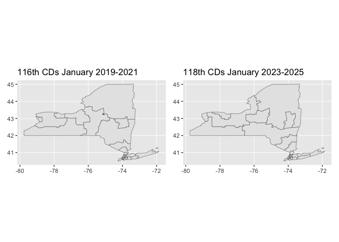

<!-- README.md is generated from README.Rmd. Please edit that file -->

# ggdistrics

<!-- badges: start -->

<!-- badges: end -->

The goal of ggdistrics is to …

## Installation

You can install the development version of ggdistrics from
[GitHub](https://github.com/) with:

``` r
# install.packages("devtools")
devtools::install_github("EvaMaeRey/ggdistrics")
```

``` r
library(ggdistrics)
library(ggplot2)
library(dplyr)
#> 
#> Attaching package: 'dplyr'
#> The following objects are masked from 'package:stats':
#> 
#>     filter, lag
#> The following objects are masked from 'package:base':
#> 
#>     intersect, setdiff, setequal, union
districts_114_flat |>
mutate(id = 1:n()) |>
ggplot() +
  aes(state = STATENAME, 
      district = DISTRICT) +
  geom_district_114(state = "New York") +
  aes(fill = DISTRICT)
```


``` r
library(ggdistrics)
library(ggplot2)
library(dplyr)
districts_114_flat |>
ggplot() +
  aes(state = STATENAME, 
      district = DISTRICT) +
  geom_district_114(state = "New York", linewidth = .02) +
  aes(fill = as.numeric(DISTRICT)) + 
  geom_district_114(state = "New York", 
                    district = 22, color = "red", linewidth = .05)
```



``` r
districts_114_flat |>
ggplot() +
  aes(state = STATENAME, 
      district = DISTRICT) +
  geom_district_114(state = "New York", 
                    district = 22, 
                    color = "red", 
                    linewidth = 1)
```


# lots of points…

``` r
library(sf)
#> Linking to GEOS 3.10.2, GDAL 3.4.2, PROJ 8.2.1; sf_use_s2() is TRUE
sum(rapply(st_geometry(districts_114), nrow)) # big
#> [1] 5508219
sum(rapply(st_geometry(ggnc::nc), nrow)) # needlessly
#> [1] 2529
```
